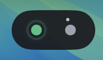

# StatusBall

A lightweight macOS floating indicator for [opencode](https://opencode.ai) sessions. Shows one colored dot per active session in a capsule that floats above all windows — including fullscreen apps, on every Space.



## Status Colors

| Color | Meaning |
|---|---|
|  **Emerald** | Running — the agent is actively working (pulses) |
|  **Gray** | Idle — session is open but not active |
|  **Blue** | Waiting for a sub-agent to complete |
|  **Amber** | Asking a question or waiting for permission (pulses) |
|  **Rose** | Stopped or errored (auto-dismisses after 1.2s) |

Sessions with active sub-agents show tiny white orbiting satellites around their dot.

## Features

- **Always on top** — uses `NSPanel` with `level = .statusBar` + `fullScreenAuxiliary`, visible over every window
- **Per-session dots** — new dot appears for each opencode session, color reflects current state
- **Sub-agent satellites** — when a session spawns background agents, small orbiting dots appear around it
- **Hover tooltip** — shows session label, status, model name, current task, and running duration
- **Auto-eviction** — idle dots disappear after 3 seconds; stopped dots after 1.2s
- **No Dock icon** — runs as a background accessory
- **LaunchAgent** — auto-starts at login, restarts on crash

## Prerequisites

- macOS 13 (Ventura) or later
- [opencode](https://opencode.ai) (tested with recent versions)
- Swift 5.9+ (included with Xcode or Command Line Tools)

## Installation

### 1. Install the App

**Option A — DMG (recommended)**

Download `OpenCodeStatusBall.dmg` from the [releases](https://github.com/nbxuhao/OpenCodeStatusBall/releases), open it, and drag `OpenCodeStatusBall.app` to the `Applications` folder.

The DMG includes a custom background with the app icon and an Applications folder shortcut.

**Option B — ZIP**

Download `OpenCodeStatusBall.zip` from the [releases](https://github.com/nbxuhao/OpenCodeStatusBall/releases), unzip and drag to `/Applications/`.

**Option C — Build from source**

```bash
git clone https://github.com/nbxuhao/OpenCodeStatusBall.git
cd OpenCodeStatusBall
swift build -c release
.build/release/OpenCodeStatusBall &
```

### 2. Install the opencode Plugin

Add the plugin to your `opencode.json` (global or project-level):

```json
{
  "plugin": ["opencode-status-ball"]
}
```

> ✅ Published on npm: https://www.npmjs.com/package/opencode-status-ball

opencode will automatically install the plugin via Bun at startup. No extra steps needed.

**Restart opencode** after adding the plugin entry.

### Verify

1. Launch OpenCodeStatusBall App
2. Restart opencode
3. Open a new session — a gray dot appears (idle)
4. Start a conversation — dot turns green (running)

### Troubleshooting

| Issue | Cause | Fix |
|---|---|---|
| No dots appear | App not running | Launch OpenCodeStatusBall first |
| Plugin load error | Missing dependency | opencode auto-installs `@opencode-ai/plugin`, restart opencode |
| Sub-agent satellites not showing | Event not received | Ensure opencode version supports `session.updated` |
| Plugin cached | Bun cached old config | Restart opencode |

## Uninstall

```bash
cd StatusBall
./launch/uninstall.sh
```

Remove the plugin entry from `opencode.json`.

## How it works

```
┌─────────────┐  events   ┌───────────────────┐  JSON lines  ┌──────────────┐
│  opencode   │ ────────▶ │  TS plugin        │ ────────────▶ │  macOS App   │
│  (session)  │           │  (per-session)    │  unix socket  │  (SwiftUI)   │
└─────────────┘           └───────────────────┘               └──────────────┘
```

- **MacOS app** — Swift Package executable. Runs as an accessory, opens a transparent `NSPanel` with the capsule UI. Listens on `/tmp/opencode-status.sock` for JSON status updates.
- **Plugin** — TypeScript plugin loaded by opencode per session. Tracks session state (idle/running/error, model name, current task) and pushes changes to the socket.

## Project Structure

```
StatusBall/
├── Package.swift
├── Sources/OpenCodeStatusBall/
│   ├── AppDelegate.swift          — @main, NSApp.accessory, wires panel + server
│   ├── FloatingBallPanel.swift    — NSPanel subclass, always-on-top configuration
│   ├── CapsuleBarView.swift       — SwiftUI capsule with session dots and tooltip
│   ├── StatusModel.swift          — Multi-session state container with auto-eviction
│   └── StatusServer.swift         — Unix domain socket server
├── plugin/
│   └── opencode-status-ball.ts    — opencode plugin
├── launch/
│   ├── com.opencode.statusball.plist  — LaunchAgent template
│   ├── install.sh                     — Build + install + bootstrap
│   └── uninstall.sh                   — Bootout + remove plist
├── screenshots/
├── LICENSE
└── README.md
```

## License

MIT
