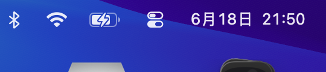

# StatusBall

A lightweight macOS floating indicator for [opencode](https://opencode.ai) sessions. Shows one colored dot per active session in a capsule that floats above all windows — including fullscreen apps, on every Space.



## Status Colors

| Color | Meaning |
|---|---|
|  **Emerald** | Running — the agent is actively working (pulses) |
|  **Gray** | Idle — session is open but not active |
|  **Blue** | Waiting for a sub-agent to complete |
|  **Amber** | Asking a question or waiting for permission (pulses) |
|  **Rose** | Stopped or errored (auto-dismisses after 1.2s) |

Sessions with active sub-agents show tiny white orbiting satellites around their dot.

## Features

- **Always on top** — uses `NSPanel` with `level = .statusBar` + `fullScreenAuxiliary`, visible over every window
- **Per-session dots** — new dot appears for each opencode session, color reflects current state
- **Sub-agent satellites** — when a session spawns background agents, small orbiting dots appear around it
- **Hover tooltip** — shows session label, status, model name, current task, and running duration
- **Auto-eviction** — idle dots disappear after 3 seconds; stopped dots after 1.2s
- **No Dock icon** — runs as a background accessory
- **LaunchAgent** — auto-starts at login, restarts on crash

## Prerequisites

- macOS 13 (Ventura) or later
- [opencode](https://opencode.ai) (tested with recent versions)
- Swift 5.9+ (included with Xcode or Command Line Tools)

## Installation

```bash
git clone https://github.com/YOUR_USER/StatusBall.git
cd StatusBall
./launch/install.sh
```

This builds the release binary, installs a LaunchAgent to auto-start at login, and launches it immediately.

### 安装 opencode 插件（配套必需）

StatusBall 需要配合 opencode 插件才能显示会话状态。插件通过 Unix socket 向 App 推送实时状态。

**方式一：npm 安装（推荐）**

直接将插件作为 npm 包添加到 `opencode.json`，opencode 启动时自动安装：

```json
{
  "plugin": ["opencode-status-ball"]
}
```

> ✅ 插件已发布到 npm：https://www.npmjs.com/package/opencode-status-ball

**方式二：本地开发（file:// 协议）**

在开发或测试时，可以使用 `file://` 协议直接加载本地文件：

```json
{
  "plugin": [
    "file:///Users/yourname/OpenCodeStatusBall/plugin"
  ]
}
```

> 路径指向包含 `package.json` 的目录。opencode 会自动加载并安装依赖。

**方式三：全局插件目录**

将插件文件复制到全局插件目录，opencode 启动时自动加载：

```bash
# 复制插件到全局插件目录
cp -r plugin ~/.config/opencode/plugins/opencode-status-ball

# 重启 opencode
```

**验证安装**

1. 确保 OpenCodeStatusBall App 已启动
2. 重启 opencode
3. 开启一个新会话，胶囊中应该出现一个灰色的 dot（idle 状态）
4. 开始对话后变成绿色（running）

**常见问题**

| 问题 | 原因 | 解决方法 |
|---|---|---|
| 没有 dots 出现 | App 未运行 | 先启动 OpenCodeStatusBall |
| 插件加载报错 | 依赖未安装 | opencode 会自动安装 `@opencode-ai/plugin`，重启即可 |
| 子 agent 卫星不显示 | 未收到子会话事件 | 确保 opencode 版本支持 `session.updated` 事件 |
| 插件加载报错 | Bun 缓存了旧配置 | 重启 opencode（Bun 会缓存插件导入） |

### Manual run (no auto-start)

```bash
swift build -c release
.build/release/OpenCodeStatusBall &
```

## Uninstall

```bash
cd StatusBall
./launch/uninstall.sh
```

Remove the plugin entry from `opencode.json`.

## How it works

```
┌─────────────┐  events   ┌───────────────────┐  JSON lines  ┌──────────────┐
│  opencode   │ ────────▶ │  TS plugin        │ ────────────▶ │  macOS App   │
│  (session)  │           │  (per-session)    │  unix socket  │  (SwiftUI)   │
└─────────────┘           └───────────────────┘               └──────────────┘
```

- **MacOS app** — Swift Package executable. Runs as an accessory, opens a transparent `NSPanel` with the capsule UI. Listens on `/tmp/opencode-status.sock` for JSON status updates.
- **Plugin** — TypeScript plugin loaded by opencode per session. Tracks session state (idle/running/error, model name, current task) and pushes changes to the socket.

## Project Structure

```
StatusBall/
├── Package.swift
├── Sources/OpenCodeStatusBall/
│   ├── AppDelegate.swift          — @main, NSApp.accessory, wires panel + server
│   ├── FloatingBallPanel.swift    — NSPanel subclass, always-on-top configuration
│   ├── CapsuleBarView.swift       — SwiftUI capsule with session dots and tooltip
│   ├── StatusModel.swift          — Multi-session state container with auto-eviction
│   └── StatusServer.swift         — Unix domain socket server
├── plugin/
│   └── opencode-status-ball.ts    — opencode plugin
├── launch/
│   ├── com.opencode.statusball.plist  — LaunchAgent template
│   ├── install.sh                     — Build + install + bootstrap
│   └── uninstall.sh                   — Bootout + remove plist
├── screenshots/
├── LICENSE
└── README.md
```

## License

MIT
